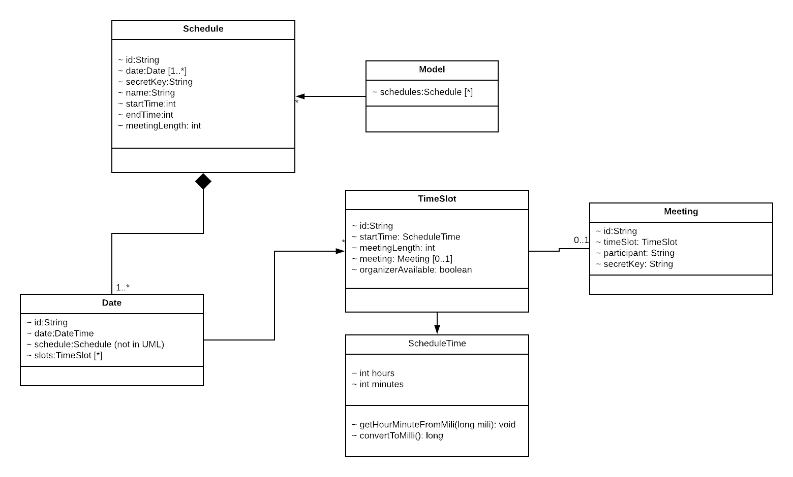

# Online Scheduler Web Application

This Maven, cloud-based project is an implementation of a web application built-from-scratch, allowing users to schedule meetings with each other as needed. The project (followed the Model-View-Controller pattern) is deployed on __AWS__, using its __Serverless Computing__, which involves __AWS IAM__, __AWS S3__, __AWS RDS__, __AWS Lambda__, __AWS API Gateway__.  

## Use Cases
### Organizer Features
- Create a new meeting schedule (with its own user-friendly name, such as “Advising Schedule”) with a fixed timeslot duration (of 10,15,20,30, or 60 minutes) that is active from a given start date up until given ending date. For each day there is a daily start hour (such as 9:00 AM or 12:00 PM) and there is a daily end hour (such as 5:00 PM or 8:00 PM). No meeting can be schedule before the start hour; no meeting can be scheduled at or later than the end hour. Upon successful creation of a meeting schedule, the organizer is given a “secret code” that will be used to authenticate all future edit/delete requests.
- Close/Open an individual time slot on a specific day (i.e., 9:30 – 9:45 on 14-Feb-2018)
- Close/Open all time slots at a given time (i.e., 9:15 – 9:30 on any day)
- Close/Open all time slots on a given day (i.e., all timeslots on 12-Feb-2018)
- Cancel any individual meeting at any time
- Review weekly schedule of meetings for a given calendar week (i.e., above is the result for the week of 12-Feb-2018) to see what meetings have been scheduled
- Once a meeting schedule is created, the organizer must tell participants about the scheduled meeting so they can start to register for meetings
- Extend the ending date of a meeting schedule to a future date
- Extend the starting date of a meeting schedule to an earlier date
- Delete a meeting schedule once it no longer is useful. Note that organizers can only delete meeting schedules that they had previously created

### Participant Features
- Review weekly schedule of meetings for a given meeting schedule, based on information from an organizer
- Create a meeting in a given open timeslot in a meeting schedule. For each such meeting, the participant can provide a string that will be recorded with the timeslot. Typically this would be just a user name, but it could also be an email address. Upon the successful creation of a meeting, the participant is given a “secret code” that will be used to authenticate all future edit/delete requests
- Cancel a previously scheduled meeting; this must be restricted so participants can only cancel a meeting that they had previously created
- Search for a list of open time slots (filtered by Month, Year, Day-Of-Week, Day-Of-Month, or Timeslot). These individual search filters can be combined to reduce the search results. Within the search results, the participant can simply create a meeting from one of the returned timeslots

### SysAdmin Features
- Retrieve a list of meeting schedules more than N days old and delete them from the system
- Retrieve a list of meeting schedules created in the past N hours

## UML Diagram

## API design with Swagger
We designed our APIs on SwaggerHub. Here is the link to our APIs: 
[API](https://app.swaggerhub.com/apis/CS3733_Heze/Scheduler_API/1.0.0)

## AWS Deployment 
1. Create IAM users with admin access for each team member.
2. Create __S3 Bucket__ and upload all static files 
3. Setup a MySQL database on __AWS RDS__ service. Uses MySQL Workbench to ssh to the server, and create tables according to our defined schema.
4. Develop, test, and upload Java files for each Lambda functions to __AWS Lambda__ platform.
5. Setup and deploy __AWS API Gateway__ 

## Future Development
Integrates __AWS Cognito__ into the application for better authentication.

## Authors
This project is designed and implemented by a team of WPI students, including: Dung (Kevin) Nguyen, Ryan Johnson, Minh Pham, Nicholas Alescio. The project is guided and supervised by professor George Heineman (WPI).

## License
This project is under MIT License. 

